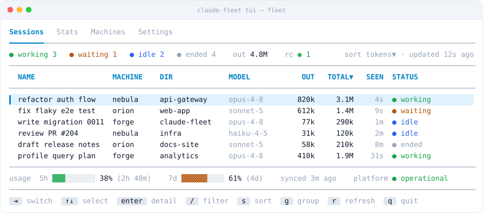
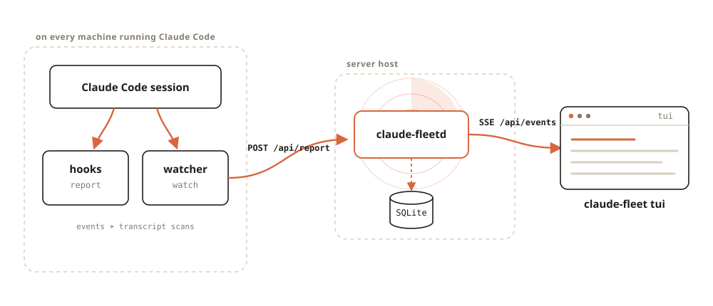

<p align="center">
  <picture>
    <source media="(prefers-color-scheme: dark)" srcset="docs/assets/wordmark-dark.svg">
    
  </picture>
</p>

<p align="center">
  Monitor your Claude Code sessions across machines from a terminal dashboard —<br>
  which sessions are running, what they're working on, and how many tokens they consume.
</p>

<p align="center">
  <a href="https://github.com/haribo/claude-vigie/releases/latest"></a>
  <a href="https://github.com/haribo/claude-vigie/actions/workflows/ci.yaml"></a>
  <a href="LICENSE"></a>
</p>

<p align="center">
  <picture>
    <source media="(prefers-color-scheme: dark)" srcset="docs/assets/hero-dark.svg">
    
  </picture>
</p>

## Features

- **Every session, every machine, one board** — nine live statuses, grouped and filtered as you like.
- **A session can call you** when its work is done.
- **Desktop notifications** when a session starts waiting on you (libnotify), and `n` to jump straight to it.
- **Terminal and browser** — a TUI, and a read-only web mirror served by the daemon itself.
- **Per-session insight** — tokens, context fill, reasoning effort, permission mode, `/rc` link.
- **Usage and history** — subscription usage, plus daily rollups of tokens and of where your time went.
- **Observe-only** — vigie never writes into a session, and stores nothing about how *you* handled one.

### A session can call you

Ask in plain language — *"when you're finished, tell me in vigie"* — and the
session raises a call as its turn ends.

<p align="center">
  <picture>
    <source media="(prefers-color-scheme: dark)" srcset="docs/assets/session-call-dark.svg">
    
  </picture>
</p>

vigie installs and keeps a small Agent Skill current so Claude knows the command
exists — nothing to run, nothing to set up per project. Your next message in that
session clears the call. It is best-effort: if Claude does not run the command,
nothing is raised.

## How it works

Claude Vigie is a central server and a client you install on every machine. Each
Claude Code session reaches the server two ways: through **hooks** — a small
`vigie report` command wired into `~/.claude/settings.json` — and through
a **watcher** that scans transcripts to cover sessions the hooks miss.

<p align="center">
  <picture>
    <source media="(prefers-color-scheme: dark)" srcset="docs/assets/how-it-works-dark.svg">
    
  </picture>
</p>

The unit of tracking is one Claude Code session. Sessions are grouped by
machine and project. See [docs/architecture.md](docs/architecture.md) for the
full design.

## Two binaries

```
vigied serve     # server: HTTP + SSE API, SQLite — runs on the host
vigied token     # server: print/generate the shared auth token
vigie  init      # client: install hooks + write the config
vigie  hooks     # client: add/remove reporting hooks (one leg per VIGIE_CONFIG)
vigie  report    # client: reporter invoked by Claude Code hooks
vigie  call      # client: raise a call for the operator, from inside a session
vigie  watch     # client: watcher — scans transcripts, covers all sessions
vigie  tui       # client: terminal dashboard
```

`vigied` is the server daemon (one host). `vigie` is the client
you install on every machine running Claude Code sessions. See
[ADR-0003](docs/adr/0003-split-client-and-daemon-binaries.md).

The daemon also serves a **read-only web dashboard** at its root URL — a browser
mirror of the TUI. Open it, paste the server token, and watch every machine
from a phone or laptop. No extra process: it is embedded in `vigied`.

## Design choices

- **Go, static binaries** — trivial self-hosting, cross-platform, minimal
  client surface (client and server are separate binaries). See
  [ADR-0002](docs/adr/0002-single-go-binary-with-sqlite.md) and
  [ADR-0003](docs/adr/0003-split-client-and-daemon-binaries.md).
- **Embedded SQLite** — no database server to deploy; full usage history.
- **Shared-token auth** — simple, suitable for personal use or a small team.
- **Tokens only** — no currency cost estimates (Claude Code subscriptions have
  no per-token price).

## Install & run

vigie ships **binaries** (`vigie`, `vigied`). How you run
and expose them — systemd, containers, TLS front — is the deployer's call; see
[docs/deployment.md](docs/deployment.md).

```bash
# on the host: run the server
vigied serve --addr :8080 --db vigie.db

# on each machine running Claude Code: connect (asks for the server and token)
vigie init

# cover already-open sessions too (run this as a service):
vigie watch

# view the board in the terminal:
vigie tui

# ...or in a browser: open http://host:8080 and paste the token
```

`vigie init` only writes the config. The **watcher** installs the reporting hooks
and the call skill when it starts, and keeps them matching the running binary —
so an upgrade needs no re-install, just a service restart. A machine that runs no
watcher can wire itself with `vigie hooks install`; `vigie hooks uninstall`
removes both.
The client reads `~/.config/vigie/config.toml` (override the path with
`VIGIE_CONFIG`, or the deprecated `FLEET_CONFIG`).

## Development

Requires Go 1.26+ and [`just`](https://github.com/casey/just).

```bash
just dev-setup      # configure git hooks
just tool-install   # install golangci-lint + goimports + govulncheck into ./bin
just code-check     # fmt + lint + build + test + vulnerability scan (run before every PR)
```

Run the current source against a throwaway local server, fully isolated from any
installed production client via `VIGIE_CONFIG` (never touches `~/.config`):

```bash
just dev-server     # background: builds & runs vigied on :8099 (dev db + token)
just dev-watcher    # background: watcher → the dev server
just dev-tui        # foreground: the TUI → the dev server
just dev-down       # stop the background dev server + watcher
```

## Disclaimer

vigie is an independent, community project. It is **not** affiliated
with, endorsed by, or sponsored by Anthropic. "Claude" and "Claude Code" are
trademarks of Anthropic, PBC, used here only to describe interoperability.

## License

[MIT](LICENSE)
